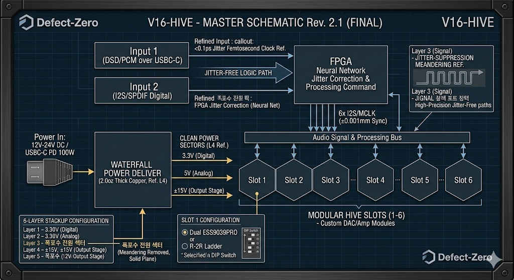
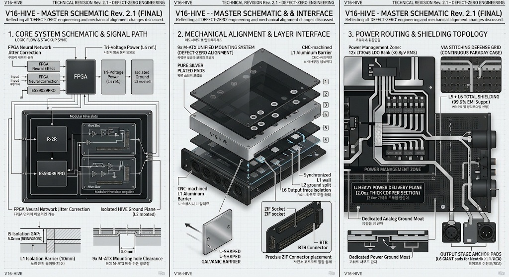
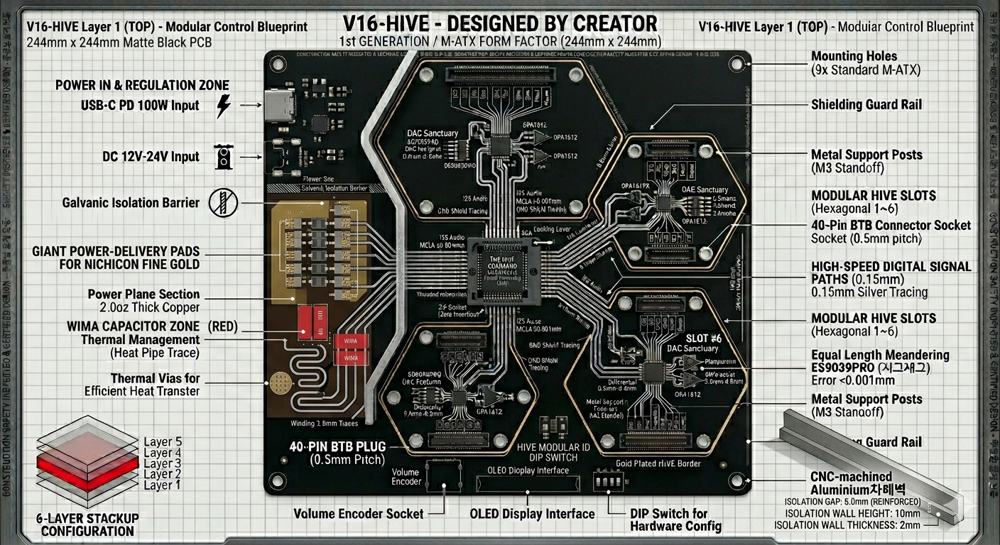
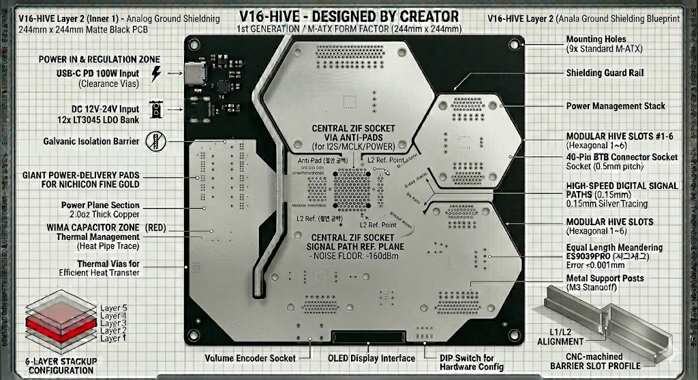
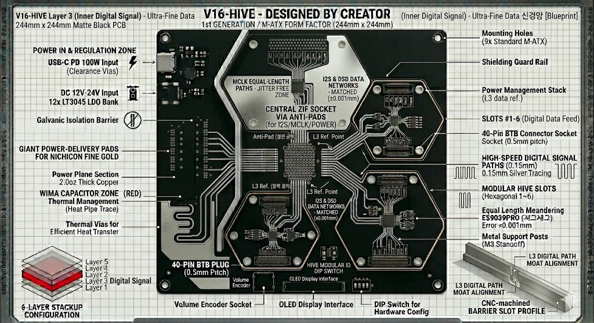
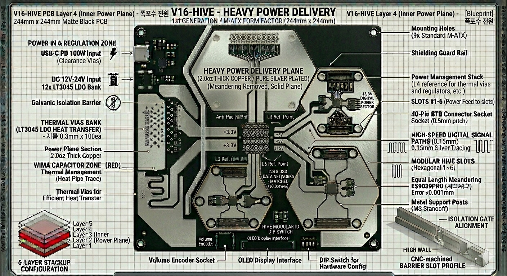
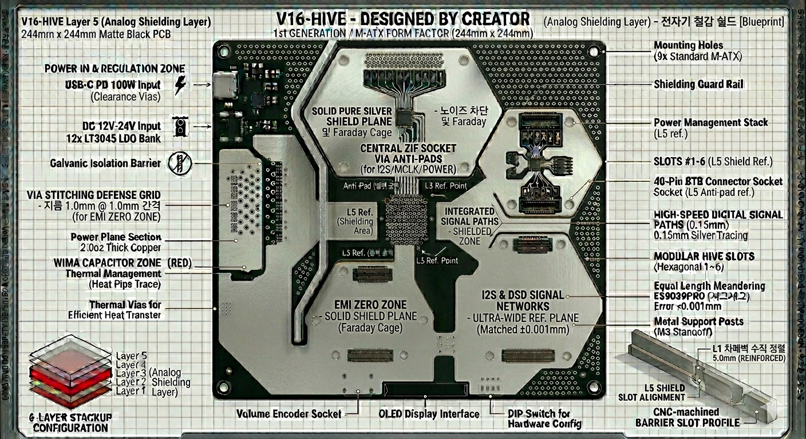
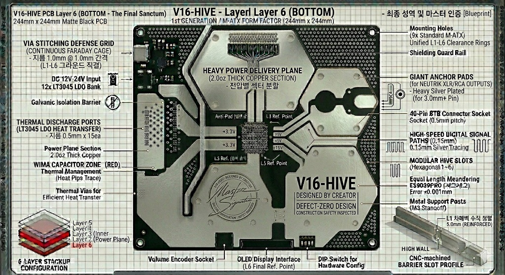
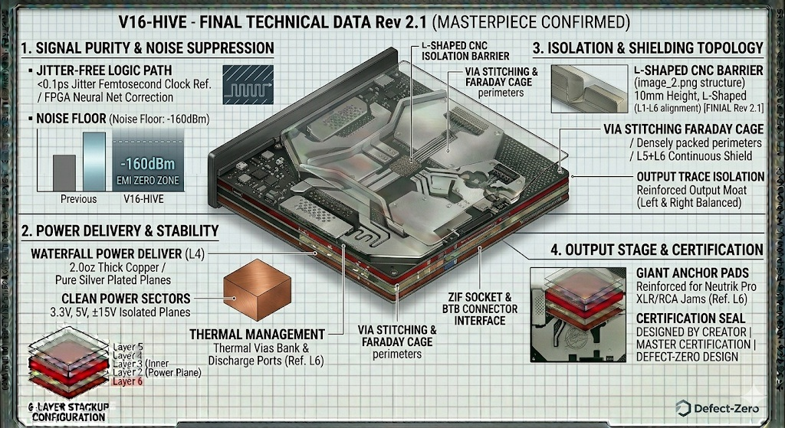
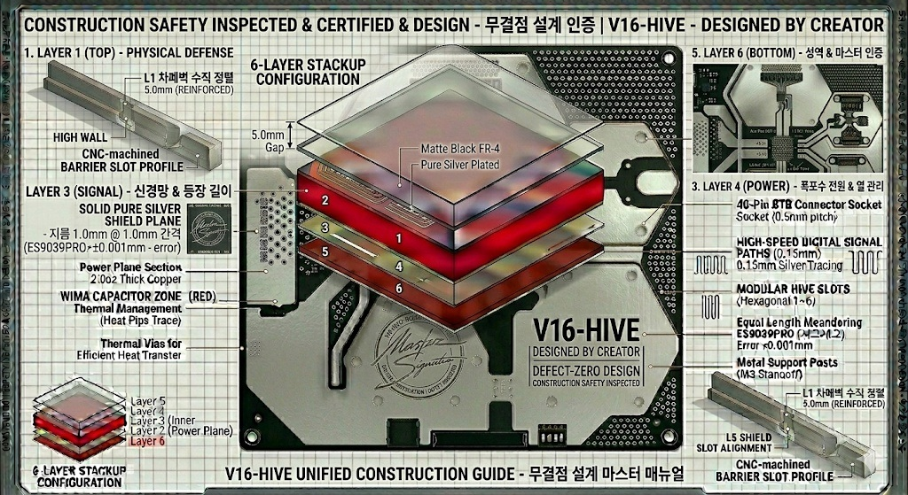

# 🐝 V16-HIVE: The Defect-Zero Masterpiece (Rev 2.1)

🐝 V16-HIVE: The Defect-Zero Masterpiece (Rev 2.1)
건설 공학적 정밀함과 전자 회로의 무결성 (Construction Engineering meets Electronic Integrity)

📋 Project Overview / 프로젝트 개요

V16-HIVE is a high-end hardware project aiming for Defect-Zero quality. By merging structural stability with precision circuitry, it achieves absolute signal purity, isolated from all external noise.

V16-HIVE 프로젝트는 하이엔드 하드웨어 설계의 무결점(Defect-Zero)을 목표로 합니다. 건축공학적 구조 안정성과 정밀 전자 회로 기술을 융합하여, 모든 외부 노이즈로부터 격리된 최상의 신호 순도를 구현했습니다.

## 🛠 **1. Assembly & Logic / 조립 및 논리 설계**

The core intelligence and skeletal structure of the device.
장치의 두뇌와 골격을 형성하는 핵심 데이터입니다.

### **[Master Schematic] - 전체 논리 회로도**

Defines the overall signal flow and power distribution logic.
시스템의 신호 흐름과 전원 분배 로직을 정의합니다.

Key Feature: Optimized jitter suppression and ultra-low noise power paths.
핵심 기능: 지터(Jitter) 억제 회로 및 초저노이즈 전원 경로 최적화.

### **[Assembly Guide] - 최종 조립 가이드**

Visualizes the assembly sequence and physical coupling of each module.
각 모듈의 체결 순서와 물리적 결합 방식을 시각화한 가이드입니다.

Key Feature: Anti-vibration and EMI-sealed structural guidance.
핵심 기능: 진동 방지 및 EMI 차폐를 위한 완벽한 밀폐 구조 가이드.

---

🏗 2. Hardware Design Layers / 레이어별 상세 분석

A deep dive into the engineering roles assigned to each of the 6 layers.
V16-HIVE의 성능을 뒷받침하는 6개 레이어의 상세 설계입니다.

Layer 1: 10mm CNC Aluminum Shielding (물리적 외부 차폐)

Layer 2: Optimized Analog Signal Routing (아날로그 경로 최적화)

Layer 3: Jitter Suppression Circuitry (디지털 신호 정밀 보정)

Layer 4: [Waterfall Power Delivery] / 폭포수 전원 공급

Uses 2.0oz thick copper for a "waterfall" power plane.

2.0oz 후막 구리를 사용한 폭포수형 전원 평면 설계.

Layer 5: [Faraday Cage Shield] / 패러데이 케이지 차폐

High-density via grid for internal signal protection.

내부 신호 보호를 위한 고밀도 비아 그리드 차폐막.

Layer 6: Physical Integrity Reinforcement (물리적 강성 보강 앵커)

---

## 📋 **3. BOM (Bill of Materials) / 부품 명세서**
The complete list of high-end components required for V16-HIVE assembly.  
V16-HIVE 조립을 위해 엄선된 하이엔드 부품 명세서입니다.

### **[ Core Electronics / 핵심 소자 ]**
| Part / 분류 | Brand - Model / 브랜드 - 모델명 | Qty / 수량 |
| :--- | :--- | :--- |
| **Main DAC** | ESS Technology - **ES9038PRO** | 1 |
| **Op-Amp** | Texas Instruments - **OPA1612** | 4 |
| **Clock (OSC)** | Crystek - **CCHD-957-25** | 1 |
| **Power LDO** | Analog Devices - **LT3045** | 6 |

 

### **[ Passive & Hardware / 수동 소자 및 하드웨어 ]**
| Part / 분류 | Brand - Model / 브랜드 - 모델명 | Qty / 수량 |
| :--- | :--- | :--- |
| **Capacitor** | **Nichicon Muse FG Series** | 12 |
| **Transformer** | **Talema 70000 Series (30VA)** | 1 |
| **I/O Jack** | **Neutrik Gold Plated Series** | 3 |
| **Chassis** | **Custom 10mm CNC Aluminum** | 1 |

 

> 💡 **Tip:** For a more detailed version including technical roles and assembly notes, please check the **[Detailed BOM File](./BOM/V16-HIVE_BOM_Global.md)**.  
> 💡 **팁:** 부품별 상세 역할과 조립 노트가 포함된 버전은 **[상세 BOM 파일](./BOM/V16-HIVE_BOM_Global.md)**에서 확인하실 수 있습니다.

---

## 🌡️ **Thermal & Safety / 발열 제어 및 안전**

V16-HIVE uses its **10mm CNC Aluminum Chassis** as a primary heat dissipation system.
V16-HIVE는 **10mm CNC 알루미늄 샤시**를 주요 방열 시스템으로 활용하여 장시간 구동에도 무결점 안정성을 유지합니다.

* **Thermal Design:** Direct contact between high-heat components (ES9038PRO, LT3045) and the aluminum casing. / 고발열 소자와 알루미늄 케이스의 직접 접촉을 통한 방열 설계.
* **Handling:** ESS chips and Op-Amps are sensitive to static. ESD protection is mandatory during assembly. / ESS 칩셋과 오디오 소자는 정전기에 민감하므로 조립 시 제전 조치가 필수적입니다.

 

## 📊 **Target Performance / 목표 성능 지표**

| Parameter / 항목 | Target Value / 목표 수치 | Description / 상세 |
| :--- | :--- | :--- |
| **SNR** | **130dB+** | Signal-to-Noise Ratio / 신호 대 잡음비 |
| **THD+N** | **< 0.0001%** | Total Harmonic Distortion + Noise / 전고조파 왜곡률 |
| **Dynamic Range** | **140dB** | Depth of Audio Signal / 오디오 신호의 다이내믹 레인지 |

---

## 📊 **4. Technical Specifications / 최종 기술 사양**

Final electrical specifications and engineering data sheets (Rev 2.1).

장치의 최종 전기적 사양과 공학적 데이터 시트입니다.

 

---

## 📂 **Project Directory Guide / 폴더 구조 가이드**

* **[Assets/](./Assets)** : High-resolution rendering & visual assets / 고해상도 렌더링 자산
* **[BOM/](./BOM/Bill%20of%20Materials)** : Master Bill of Materials (Technical Specs) / 부품 명세서 및 기술 사양
* **[Docs/](./Docs)** : Technical datasheets & construction manuals / 기술 데이터시트 및 매뉴얼
* **[Hardware_Design/](./Hardware_Design)** : 6-Layer PCB design assets (L1-L6) / 레이어별 설계 데이터
* **[Schematics/](./Schematics)** : Master logic circuit diagrams / 논리 회로 마스터 파일

 

## 🌍 **Global Access & Policy / 글로벌 정책**

* **Language:** All documentation is maintained in **English and Korean**. / 모든 문서는 영어와 한국어로 유지됩니다.
* **Contribution:** We welcome global open-source contributors for firmware & hardware optimization. / 전 세계 기여자의 참여를 환영합니다.
* **License:** **CC BY-NC-SA 4.0** (Non-Commercial). / 상업적 이용 금지 및 저작자 표시 필수.

---

👹Creator's Note / 설계자 노트

👹Original CAD/Source files are not included in this repository.

👹원본 CAD 및 소스 파일은 이 레포지토리에 포함되어 있지 않습니다.

 

---

### ⚠️ **Notice: Design Asset Integrity / 설계 자산의 완결성 고지**

**Original CAD source files (Altium/KiCad/STEP) are not included in this repository.** **원본 CAD 소스 파일(Altium/KiCad/STEP)은 본 레포지토리에 포함되어 있지 않습니다.**

However, we provide comprehensive, high-resolution visual documentation and precise physical dimensions for every layer (L1–L6). These assets contain all necessary engineering data to understand the architectural essence of V16-HIVE.  
하지만, 모든 레이어(L1~L6)에 대한 방대한 고해상도 시각 문서와 정밀한 물리적 수치를 제공합니다. 이 자산들은 V16-HIVE의 아키텍처 정수를 파악하기 위한 모든 필수 공학 데이터를 포함하고 있습니다.

* **Visual Schematics:** Full trace logic and component placement details. / 전체 배선 로직 및 부품 배치 디테일 제공.
* **Dimensional Accuracy:** Calculated values for absolute performance. / 절대적 성능을 위해 계산된 정밀 수치 포함.

---
