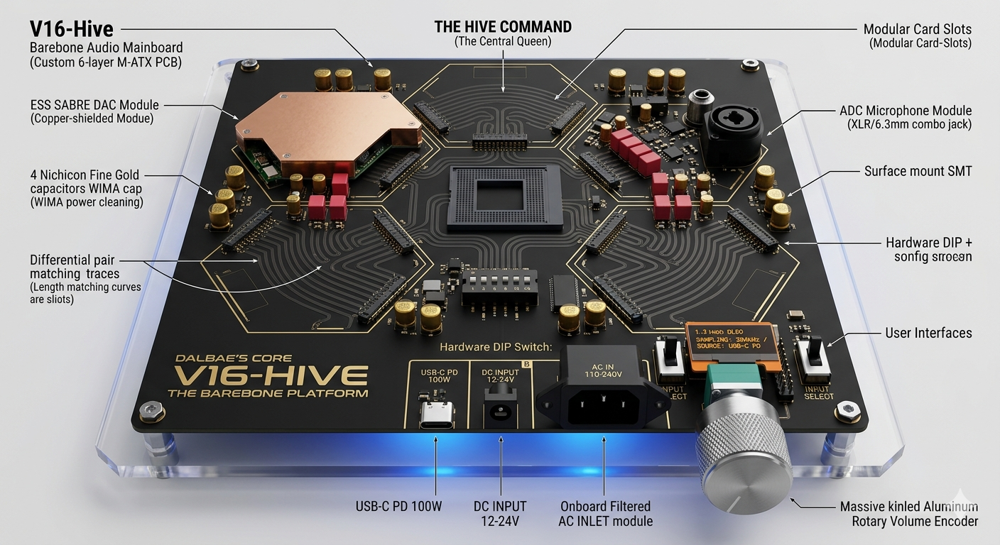

# V16-HIVE-The-Monolith
High-end Quad-Parallel DAC Architecture. Architecture by [Archmit_Director].

# 🛸 V16-HIVE: The Monolith Audio Platform

**[KR]** 하이엔드 쿼드-병렬 DAC 아키텍처, 'V16-HIVE' 프로젝트에 오신 것을 환영합니다. 이 프로젝트는 단순한 오디오 기기를 넘어, 모듈형 벌집 구조(Honeycomb)를 통해 무한한 확장성을 지향하는 하드웨어 플랫폼입니다.

**[EN]** Welcome to 'V16-HIVE: The Monolith', a high-end quad-parallel DAC architecture. This is a hardware platform that pursues infinite scalability through a modular honeycomb structure.

---

## 🧬 Master Logic & Schematic

- **High-Speed I/O:** Powered by XMOS XU316 (16-Core).
- **Quad-Core Fusion:** Noise reduction by n=4 through parallel DAC cores.
- **Master Clock:** Ultra-precision MCLK with ±0.001mm length matching traces.

## 📐 Hardware Architecture (Top & Bottom)

- **A-Side:** Signal paths and 4x Honeycomb Modular Slots.
- **B-Side:** Massive power management with 32x ADI LT3045 parallel arrays.
- **Isolation:** Strictly segmented ground and power isolation zones.

---

## 👹 Call for "Hardware Devils"
**I provide the Vision, you provide the manifest.**
이 프로젝트는 원본 CAD 파일이 없습니다. 하지만 보시다시피 완벽한 논리 도면과 물리적 레이아웃 가이드가 준비되어 있습니다. 이 비전을 실제 PCB(Gerber)로 구현하여 세상을 놀라게 할 엔지니어를 찾습니다.

- **Status:** Architecture Design 100% / Logic Defined.
- **Goal:** Manifesting the physical PCB and Modular Cards.

---

## ⚖️ License
This project is licensed under **CC BY-NC 4.0** (Creative Commons Attribution-NonCommercial). 
상업적 이용을 금하며, 인용 시 반드시 출처를 밝혀야 합니다.
This project is licensed under [CC BY-NC 4.0]
(https://creativecommons.org/licenses/by-nc/4.0/).

## 📂 Deep Dive into Technical Data
- [Detailed Technical Specifications](./Technical_Specifications.md)
- [40-Pin Slot Pinout Standard](./Pinout_Standard.md)
- [Core Bill of Materials (BOM)](./BOM_List.csv)
